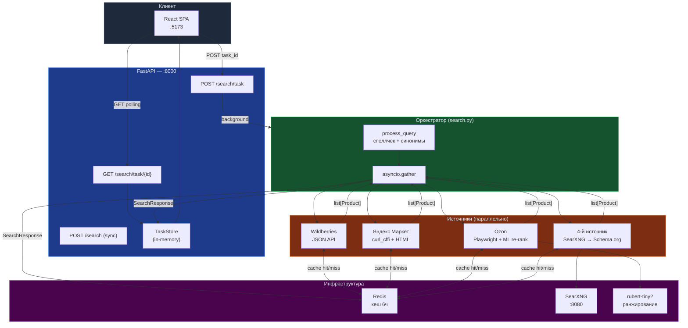
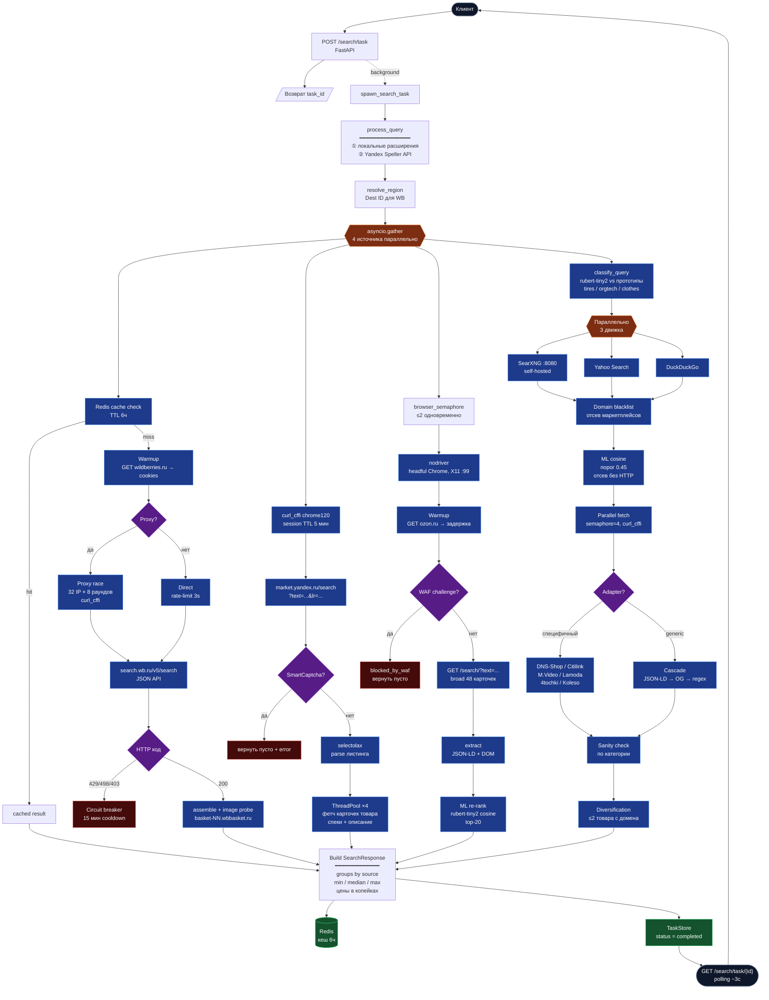
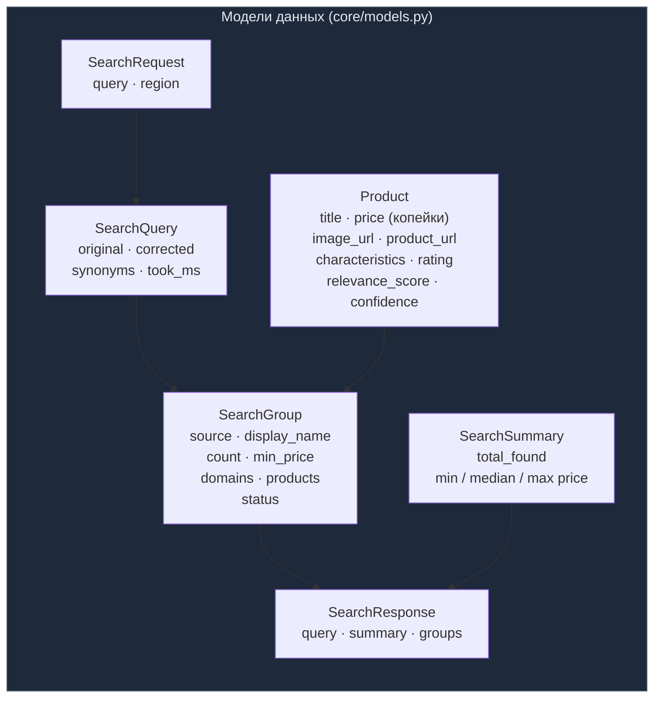

# Tender Hack — Price Aggregator

Интеллектуальный сервис агрегации цен с маркетплейсов и открытых источников Рунета.  
Параллельно опрашивает **Wildberries**, **Ozon**, **Яндекс Маркет** и **динамический 4-й источник** через SearXNG.

---

## Содержание

- [Быстрый старт](#быстрый-старт)
- [Архитектура](#архитектура)
- [Источники данных](#источники-данных)
- [API](#api)
- [Конфигурация](#конфигурация)
- [Локальная разработка](#локальная-разработка)
- [Тестирование](#тестирование)
- [Структура монорепо](#структура-монорепо)
- [Документация](#документация)

---

## Быстрый старт

```bash
git clone https://github.com/IR630/tender_hack.git
cd tender_hack
cp .env.example .env

# Гибридный режим: инфра в Docker, API на хосте
cd docker && bash up.sh
```

| Сервис | URL |
|---|---|
| Frontend | http://127.0.0.1:5173 |
| API | http://127.0.0.1:8000 |
| Swagger UI | http://127.0.0.1:8000/docs |
| SearXNG | http://127.0.0.1:8080 |

> **Почему API на хосте?**  
> Playwright/nodriver требует реальный X-дисплей (`DISPLAY=:99`). В гибридном режиме API видит дисплей хоста, а Redis и SearXNG живут в Docker.

Полная инструкция по запуску: [docs/run.md](docs/run.md) · Docker-only: [docs/docker-run.md](docs/docker-run.md)

---

## Архитектура

### Общая схема системы



### Полный путь поискового запроса



### Слои данных



---

## Источники данных

| Источник | Метод | Антибот | Лимит |
|---|---|---|---|
| **Wildberries** | JSON API (`search.wb.ru`) | Proxy race (32 IP), circuit breaker, rate-limit 3s | 15 товаров |
| **Яндекс Маркет** | `curl_cffi` chrome120 + selectolax HTML | TLS impersonation, сессия 5 мин, Cloudflare Workers | 20 товаров |
| **Ozon** | Playwright + nodriver (headful Chrome) | playwright-stealth, X11 headful, semaphore ≤2, warmup | top-20 после ML re-rank |
| **4-й источник** | SearXNG → curl_cffi → Schema.org | Domain blacklist, ML snippet-фильтр, ≤2 с домена | 10–15 товаров |

### Антибот-слои подробно

```mermaid
graph TD
    subgraph WB["Wildberries"]
        WBR["Rhythm (≥3s между запросами)"]
        WBP["Proxy race\n32 Cloudflare Workers IP"]
        WBC["Circuit breaker\n15 мин cooldown"]
        WBCa["Redis cache 6ч"]
        WBR --> WBP --> WBC --> WBCa
    end

    subgraph YM["Яндекс Маркет"]
        YMT["TLS fingerprint\nchrome120 via curl_cffi"]
        YMS["Сессия-пул\nTTL 5 мин"]
        YMB["Backoff 429\n2→4→8→16s"]
        YMT --> YMS --> YMB
    end

    subgraph OZ["Ozon"]
        OZS["playwright-stealth\nwebdriver=false"]
        OZX["Headful X11 :99\nне headless"]
        OZW["Warmup flow\nглавная → задержка → поиск"]
        OZM["browser_semaphore\n≤2 одновременно"]
        OZS --> OZX --> OZW --> OZM
    end

    subgraph OT["4-й источник"]
        OTB["Domain blacklist\n(маркетплейсы, агрегаторы)"]
        OTM["ML cosine similarity\nпорог 0.45"]
        OTD["Diversification\n≤2 товара с домена"]
        OTB --> OTM --> OTD
    end
```



---

## API

### Эндпоинты

| Метод | Путь | Описание |
|---|---|---|
| `POST` | `/search/task` | Создать задачу поиска (async) |
| `GET` | `/search/task/{id}` | Получить статус / результат |
| `POST` | `/search` | Синхронный поиск (dev/debug) |
| `POST` | `/search/mock` | Mock-ответ для UI-тестов |
| `GET` | `/regions` | Список доступных регионов |
| `GET` | `/health` | Проверка живости |
| `GET` | `/health/wb` | Конфигурация WB scraper |
| `GET` | `/wb_metrics` | Метрики производительности WB |
| `GET` | `/images/{path}` | Прокси изображений |

### Polling-flow

```
POST /search/task          → {"task_id": "uuid"}
GET  /search/task/{id}     → {"status": "pending"}   # ~сразу
GET  /search/task/{id}     → {"status": "running", "groups": [...]}  # частичные результаты
GET  /search/task/{id}     → {"status": "completed", "result": {...}}  # готово
```

### Пример ответа

```jsonc
{
  "task_id": "550e8400-e29b-41d4-a716-446655440000",
  "status": "completed",
  "result": {
    "query": {
      "original": "ноутбук",
      "corrected": "ноутбук",
      "region": "moscow",
      "synonyms_used": [],
      "took_ms": 4231
    },
    "summary": {
      "total_found": 52,
      "min_price": 2990000,   // копейки → 29 900 ₽
      "median_price": 7450000,
      "max_price": 28990000
    },
    "groups": [
      {
        "source": "wildberries",
        "display_name": "Wildberries",
        "count": 15,
        "min_price": 2990000,
        "status": "complete",
        "products": [
          {
            "title": "Ноутбук ASUS VivoBook 15",
            "price": 4590000,
            "image_url": "https://...",
            "product_url": "https://wildberries.ru/...",
            "characteristics": {"RAM": "16 GB", "SSD": "512 GB"},
            "rating": 4.7,
            "relevance_score": 0.92
          }
        ]
      }
    ]
  }
}
```

---

## Конфигурация

Все настройки читаются из `backend/.env` или `.env` в корне через `pydantic-settings`.

### Ключевые переменные

| Переменная | По умолчанию | Описание |
|---|---|---|
| `SEARCH_ENABLED_SOURCES` | `wildberries,yandex_market,ozon,other` | Активные источники |
| `REDIS_URL` | `redis://127.0.0.1:6379/0` | Адрес Redis |
| `SEARXNG_URL` | `http://127.0.0.1:8080` | Self-hosted SearXNG |
| `CACHE_TTL_SECONDS` | `21600` | TTL кеша (6 часов) |
| `SCRAPER_TIMEOUT_SECONDS` | `8` | Таймаут для каждого источника |
| `WB_PROXY` | — | Прокси для WB (Cloudflare Worker URL) |
| `WB_PROXY_PARALLEL_ATTEMPTS` | `32` | Параллельных IP в гонке |
| `OZON_USE_BROWSER` | `true` | Включить Playwright для Ozon |
| `OZON_BROWSER_HEADLESS` | `false` | Headless блокируется WAF — не включать! |
| `OZON_TWO_STAGE_ENABLED` | `true` | Двухэтапный поиск (broad + ML) |
| `OZON_BROAD_SEARCH_MAX` | `48` | Кол-во товаров на 1-м этапе |
| `OZON_ML_TOP_K` | `20` | Топ-N после ML re-rank |
| `QUERY_SPELL_ENABLED` | `true` | Коррекция опечаток через Yandex Speller |

---

## Локальная разработка

### Требования

- Python 3.12+, [uv](https://docs.astral.sh/uv/)
- Node.js 20+, pnpm
- Docker (для Redis, SearXNG)
- Linux с X-сервером (для Ozon Playwright)

### Backend

```bash
cd backend

# Установка зависимостей
uv sync

# Запуск с hot-reload
uv run uvicorn app.main:app --reload

# Линтер + форматирование
uv run ruff check .
uv run ruff format .

# Smoke-тест против работающего сервера
uv run python scripts/smoke_search.py
```

### Frontend

```bash
cd frontend
pnpm install
pnpm dev       # http://127.0.0.1:5173
pnpm build
```

### Инфраструктура (Docker)

```bash
# Полный стек (Redis, SearXNG, frontend)
cd docker && bash up.sh

# Только инфра (API запускать на хосте)
docker compose -f docker-compose.hybrid.yml up -d

# Остановить всё
docker compose down
```

---

## Тестирование

```bash
cd backend

# Unit-тесты (без сети, ~30s)
uv run pytest

# Один файл
uv run pytest tests/test_wb_scraper.py -v

# Интеграционные тесты (живая сеть)
uv run pytest -m integration

# С логами
uv run pytest -s --log-cli-level=DEBUG
```

**Маркеры:**

| Маркер | Описание |
|---|---|
| `integration` | Требует реального интернета и запущенных сервисов |
| (без маркера) | Unit-тесты, безопасно запускать без сети |

---

## Структура монорепо

```
tender_hack/
├── backend/
│   └── app/
│       ├── api/routes/          # HTTP-эндпоинты (search, regions, images)
│       ├── core/                # config, models, cache, browser_semaphore
│       ├── scrapers/
│       │   ├── wb/              # WB: scraper, session, proxy, circuit, rhythm, assemble
│       │   ├── ozon.py          # Ozon scraper
│       │   ├── ozon_browser.py  # Playwright + nodriver
│       │   ├── two_stage_ozon.py
│       │   ├── ozon_ml_filter.py
│       │   └── yandex_market.py
│       ├── sources/other/       # 4-й источник (SearXNG → Schema.org → vision)
│       ├── query/               # process_query, Yandex Speller
│       ├── ml/                  # rubert-tiny2 ранжировщик
│       ├── orchestrator/        # asyncio.gather, run_search
│       ├── tasks/               # TaskStore (статусы фоновых задач)
│       └── main.py
├── frontend/
│   └── src/
│       ├── components/          # ProductCard, SourceGroup, SearchProgress, RegionSelector
│       ├── types/search.ts      # TypeScript-типы (синхронизировать с models.py)
│       └── App.tsx
├── docker/                      # Docker Compose, Dockerfile.api, Dockerfile.frontend
├── docs/                        # Архитектура, Git Flow, Contributing
└── scripts/                     # smoke_search.py и другие утилиты
```

| Путь | Назначение |
|---|---|
| `backend/app/scrapers/wb/` | Wildberries — JSON API, прокси, circuit breaker |
| `backend/app/scrapers/ozon_browser.py` | Ozon — Playwright stealth |
| `backend/app/scrapers/yandex_market.py` | ЯМ — curl_cffi + selectolax |
| `backend/app/sources/other/` | 4-й источник — SearXNG + Schema.org |
| `backend/app/orchestrator/search.py` | Главная оркестрация (asyncio.gather) |
| `backend/app/query/processor.py` | Нормализация запроса |
| `backend/app/ml/ranker.py` | rubert-tiny2 эмбеддинги |
| `backend/app/core/models.py` | Product, SearchGroup, SearchResponse |
| `backend/app/core/config.py` | Все настройки (60+ параметров) |

---

## Технологический стек

### Backend

| Компонент | Технология |
|---|---|
| Framework | FastAPI + Uvicorn (ASGI) |
| HTTP-клиент | `curl_cffi` (chrome120 TLS impersonation) |
| Браузер | Playwright + `nodriver` + `playwright-stealth` |
| HTML-парсинг | `selectolax` (быстро), `trafilatura` (текст) |
| ML/NLP | `rubert-tiny2` через `sentence-transformers` |
| Кеш | Redis (6ч) + `diskcache` для больших данных |
| Поиск | SearXNG self-hosted |
| Валидация | Pydantic v2 |
| Логирование | `structlog` |
| Retry | `tenacity` |

### Frontend

| Компонент | Технология |
|---|---|
| Framework | React 19 + TypeScript |
| Build | Vite |
| Стили | Tailwind CSS + shadcn/ui |
| Пакеты | pnpm |

### Инфраструктура

| Компонент | Технология |
|---|---|
| Контейнеры | Docker Compose |
| Кеш | Redis 7 Alpine |
| Метапоиск | SearXNG |
| Full-text | MeiliSearch (опционально) |
| CI | GitHub Actions |

---

## Документация

- [Запуск проекта](docs/run.md)
- [Docker-only деплой](docs/docker-run.md)
- [Архитектурные ограничения хакатона](docs/ARCHITECTURE_CONSTRAINTS.md)
- [Git Flow](docs/GITFLOW.md)
- [Contributing](docs/CONTRIBUTING.md)
- [Технические шпаргалки](docs/README.md)
- [Обзоры для новичков](docs/obzor/README.md)
- [Условия задачи](task.md)

---

## Git Flow

Все изменения — **только через Pull Request** в `main`. CI должен пройти + 1 approve.

```
feature/xyz  →  PR  →  main
bugfix/xyz   →  PR  →  main
```

Подробнее: [docs/GITFLOW.md](docs/GITFLOW.md)
