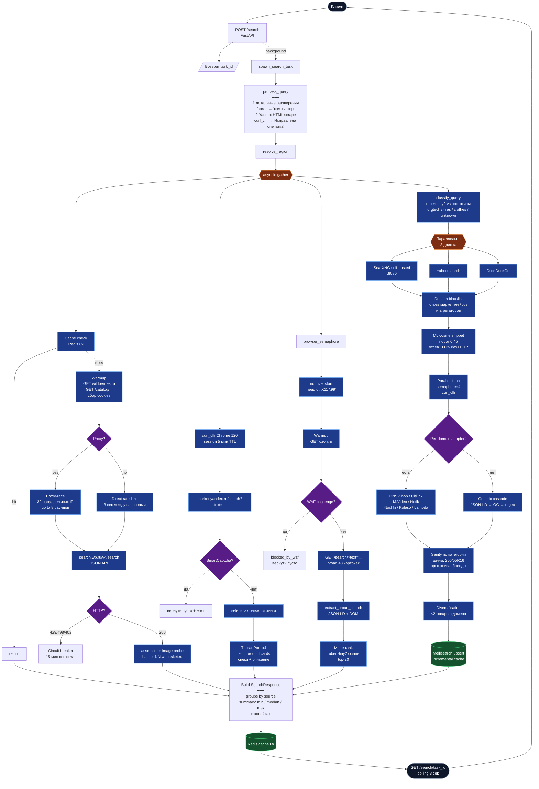

# Tender Hack — Price Aggregator

Интеллектуальный сервис поиска цен с маркетплейсов (WB, Ozon, Яндекс Маркет) и динамических источников Рунета.

## Quick Start

```bash
git clone https://github.com/IR630/tender_hack.git
cd tender_hack
cp .env.example .env
./start_demo.sh
```

**Нужен Docker?** Да, для frontend и инфра (Redis, SearXNG, MeiliSearch). API запускается **на хосте** через [uv](https://docs.astral.sh/uv/) — так Ozon browser работает на обычном Linux с экраном.

Подробная инструкция: [docs/run.md](docs/run.md) · Docker-only: [docs/docker-run.md](docs/docker-run.md)

- **Frontend:** http://127.0.0.1:5173
- **API:** http://127.0.0.1:8000
- **API docs:** http://127.0.0.1:8000/docs
- **SearXNG:** http://127.0.0.1:8080

## Локальная разработка

```bash
# Backend
cd backend && uv sync && uv run uvicorn app.main:app --reload

# Frontend (в другом терминале)
cd frontend && pnpm install && pnpm dev
```

## Структура monorepo

| Путь | Назначение | Владелец |
|---|---|---|
| `frontend/` | React UI | Dev 1 |
| `backend/app/scrapers/` | WB, Ozon, Яндекс Маркет | Dev 2 |
| `backend/app/sources/` | 4-й динамический источник | Dev 3 |
| `backend/app/api/`, `query/`, `ml/`, `orchestrator/` | API, ML, оркестрация | Dev 4 |
| `docker/` | Docker Compose, инфра | все |
| `docs/` | Git Flow, contributing | все |

## Как работает поиск

Полный путь запроса от клиента до ответа: обработка запроса (опечатки + синонимы), параллельный опрос четырёх источников через `asyncio.gather`, антибот-слои и кеш на каждом канале, сборка ответа и polling результата.



## Git Flow

Все изменения — **только через Pull Request** в `main`. CI должен пройти + 1 approve.

Подробнее: [docs/GITFLOW.md](docs/GITFLOW.md)

## Документация

- [**Документация**](docs/README.md) — технические шпаргалки
- [**Обзоры для новичков**](docs/obzor/README.md) — простым языком
- [Архитектура (набросок)](architecture.md)
- [Условия хакатона](task.md)
- [Contributing](docs/CONTRIBUTING.md)
- [Ограничения хакатона](docs/ARCHITECTURE_CONSTRAINTS.md)
- [Запуск проекта](docs/run.md)
- [Docker-only](docs/docker-run.md)

## Стек

- **Backend:** FastAPI, uv, Redis
- **Frontend:** React, Vite, Tailwind
- **Infra:** Docker Compose, SearXNG, GitHub Actions CI
