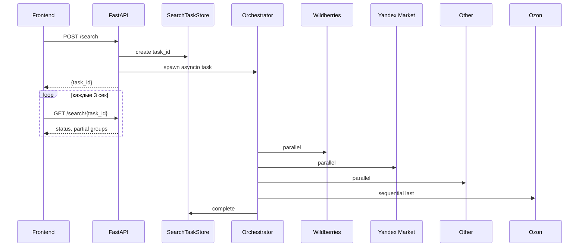

# Пайплайн и оркестрация

Объединяет: оркестратор, task store, query processor, scraper base, ML ranker (stub).

## Сквозной поток



## Оркестратор

**Код:** `backend/app/orchestrator/search.py`

| Функция | Назначение |
|---------|------------|
| `run_search` | Blocking поиск (`/search/sync`) |
| `run_search_task` | Фон + incremental progress |
| `spawn_search_task` | `asyncio.create_task` |
| `_safe_search` | Exception → `[]` + error string |

### Алгоритм

1. `process_query` → `resolve_region`
2. **Parallel:** WB, YM, Other (`asyncio.gather`)
3. **Sequential:** Ozon (медленный, semaphore Chromium)
4. `_build_response` → summary + ordered groups

### Порядок групп

```python
SOURCE_ORDER = ("wildberries", "yandex_market", "other", "ozon")
```

### Summary

min / median / max по всем `price > 0` из всех групп. Цены в **копейках**.

### Progress messages (RU)

- «Wildberries…»
- «Яндекс Маркет…»
- «Другие источники…»
- «Ozon: браузер проходит WAF (до 35 с)…»
- «Готово: {source}»

---

## Task Store

**Код:** `backend/app/tasks/store.py`

In-process dict для polling. **Не Redis**, не переживает restart.

| Метод | Действие |
|-------|----------|
| `create()` | UUID, status=pending |
| `update_progress(message, groups)` | Partial results для UI |
| `complete(result)` | status=completed |
| `fail(error)` | status=failed |

TTL purge: 3600 с. Lock: `asyncio.Lock`.

---

## Query Processor

**Код:** `backend/app/query/processor.py`

**Stub:** только `query.strip()`. SymSpell / WordNet / Ollama — не реализованы.

```python
ProcessedQuery(original, corrected, synonyms=[])
```

Scrapers получают `corrected`. Response хранит `original`, `corrected`, `synonyms_used`.

---

## Scraper Base

**Код:** `backend/app/scrapers/base.py`

```python
class BaseScraper(ABC):
    source: str
    last_error: str | None
    last_source_status: str | None   # e.g. "blocked_by_waf" для Ozon
    async def search(request) -> list[Product]
```

Оркестратор читает `last_error` / `last_source_status` после `_safe_search`.

---

## ML Ranker (stub)

**Код:** `backend/app/ml/ranker.py`

```python
def rank_products(query, products):
    return sorted(products, key=lambda p: p.relevance_score, reverse=True)
```

**Не подключён** к оркестратору. Отличие от Ozon ML filter — см. [../marketplaces/ozon.md](../marketplaces/ozon.md).

---

## Latency по источникам

| Источник | Parallel/Sequential | Типично |
|----------|---------------------|---------|
| Wildberries | parallel | 1–3 с |
| Yandex Market | parallel | 5–20 с |
| Other | parallel | 0 с |
| Ozon | **sequential last** | 35–180 с |

## Ключевые файлы

```
backend/app/
├── orchestrator/search.py
├── tasks/store.py
├── query/processor.py
├── ml/ranker.py
└── scrapers/base.py
```

## Маркетплейсы

Детали обхода: [../marketplaces/README.md](../marketplaces/README.md)
