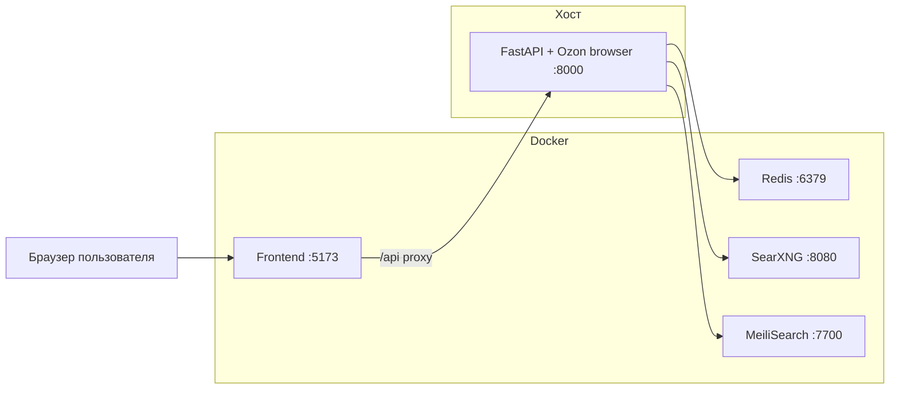

# Запуск проекта

Один сценарий для демо и проверки на любой машине команды — **`./start_demo.sh`**.

---

## Быстрый старт

```bash
git clone https://github.com/IR630/tender_hack.git
cd tender_hack
cp .env.example .env
./start_demo.sh
```

| Сервис | URL |
|--------|-----|
| UI | http://127.0.0.1:5173 |
| API | http://127.0.0.1:8000 |
| Swagger | http://127.0.0.1:8000/docs |
| Health | http://127.0.0.1:8000/health |

Остановка: **Ctrl+C** в том же терминале. Зависший Chromium: `./kill_zombies.sh`.

---

## Нужен ли Docker?

**Да, но не для всего.** `./start_demo.sh` — **гибридный** режим:

| Компонент | Где запускается | Зачем |
|-----------|-----------------|-------|
| Frontend (nginx + React) | Docker | не нужны Node.js и pnpm |
| Redis, SearXNG, MeiliSearch | Docker | инфра «из коробки» |
| **API** (FastAPI, scrapers, Ozon browser) | **ваша машина (хост)** | Ozon блокирует Chromium в изолированном Docker |

На хосте ставите только **Docker** и **[uv](https://docs.astral.sh/uv/)** — зависимости Python подтянутся при первом запуске.



---

## Требования

| | Обязательно | Для Ozon |
|--|-------------|----------|
| Docker Engine 24+ и `docker compose` v2 | ✅ | ✅ |
| [uv](https://docs.astral.sh/uv/) | ✅ | ✅ |
| Linux с графической сессией (`echo $DISPLAY` → `:0` или `:1`) | — | ✅ рекомендуется |
| ~4 GB свободной RAM | ✅ | ✅ |

**Linux (uv):**

```bash
curl -LsSf https://astral.sh/uv/install.sh | sh
```

**Arch / Manjaro (xvfb, если нет DISPLAY):**

```bash
sudo pacman -S xorg-server-xvfb
```

Первый запуск может занять **5–15 минут**: сборка frontend-образа, скачивание контейнеров, `uv sync`, при первом поиске Ozon — загрузка ML-модели.

---

## Что делает `./start_demo.sh`

1. Поднимает в Docker: frontend, Redis, SearXNG, MeiliSearch (`docker-compose.hybrid.yml`).
2. Выполняет `uv sync` в `backend/`.
3. Запускает API на хосте: `uvicorn` на `http://127.0.0.1:8000`.
   - если задан `DISPLAY` — Chromium использует ваш экран;
   - иначе — `xvfb-run` (Ozon может блокироваться WAF).
4. По **Ctrl+C** останавливает API, `docker compose down`, чистит зомби-Chromium.

Переменные Ozon уже выставлены в скрипте (browser warmup, таймауты). При необходимости переопределите через `.env` или export перед запуском.

---

## Альтернативные режимы

| Задача | Команда | Ozon browser |
|--------|---------|--------------|
| **Демо / хакатон (рекомендуется)** | `./start_demo.sh` | ✅ с `DISPLAY` |
| Весь стек в Docker + X11 с хоста | `./docker/up.sh` | ✅ |
| Весь стек в Docker без X11 (CI, сервер) | `docker compose -f docker/docker-compose.yml up --build` | ❌ часто WAF |
| Разработка UI/API без Docker | см. [CONTRIBUTING.md](CONTRIBUTING.md) | ✅ API на хосте |

Подробности по Docker-only: [docker-run.md](docker-run.md).

---

## Проверка

```bash
curl http://127.0.0.1:8000/health
# {"status":"ok"}
```

Откройте http://127.0.0.1:5173, введите запрос — должны прийти результаты WB, Yandex Market и (при рабочем Ozon) Ozon.

---

## Типичные проблемы

| Симптом | Решение |
|---------|---------|
| Порт 8000 занят | `fuser -k 8000/tcp` |
| `uv: command not found` | установите [uv](https://docs.astral.sh/uv/) |
| Ozon «доступ ограничен» / WAF | убедитесь, что `echo $DISPLAY` не пустой; не используйте чистый Docker без X11 |
| UI не открывается | `docker compose -f docker-compose.hybrid.yml ps` — контейнеры должны быть Up |
| Зависший Chromium | `./kill_zombies.sh` |
| Docker permission denied | добавьте пользователя в группу `docker` или запускайте через `sudo` (не рекомендуется) |

---

## Связанные документы

- [infrastructure.md](categories/infrastructure.md) — регионы, semaphore, env
- [infrastructure-obzor.md](categories/infrastructure-obzor.md) — обзор для новичков
- [docker-run.md](docker-run.md) — полный стек в Docker
- [CONTRIBUTING.md](CONTRIBUTING.md) — локальная разработка без Docker
